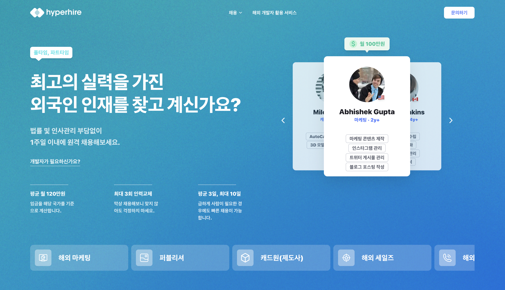

# Hyperhire Landing Page - Frontend Challenge

A high-performance, responsive landing page built with **Next.js 14** and **Atomic Design principles**, demonstrating modern frontend best practices.



## 🚀 Project Overview

The goal of this project was to implement a pixel-perfect, mobile-responsive landing page based on the Hyperhire design. It features complex UI interactions, including a 3D-style cards slider, dynamic entrance animations, and a polished mobile navigation experience.

### Key Features

- **✨ Atomic Design Architecture**: Components organized into Atoms, Molecules, and Organisms for maximum reusability and maintainability.
- **📱 Responsive & Adaptive**: Fully optimized for **Mobile and Desktop**, with specific UI changes (e.g., simplified headers, touch-friendly sliders) for smaller screens.
- **🎨 Custom Design System**: Implemented a scalable Tailwind CSS theme with defined color palettes, typography, and spacing tokens.
- **⏩ Performance Optimized**: utilized `next/image` for asset optimization and `framer-motion` for hardware-accelerated animations.
- **🕸️ Dynamic Data Mocking**: Custom API route (`/api/mock-data`) simulates real-world data fetching with artificial delays to showcase loading states.

## 🧠 Technical Implementation Details

### 1. Simulated Latency & Custom Loader
You might notice a **2-second delay** upon initial load. This is **intentional**.
-   **Why?**: To demonstrate the custom "Hiring Radar" loading animation (`src/app/loading.tsx`).
-   **How**: The server-side data fetching includes a `setTimeout` to mimic network latency, triggering Next.js's suspense boundary and showing the loading UI before the main content streams in.

### 2. Server-Side Rendering (SSR) Pattern

- Data is fetched entirely on the server within `page.tsx` using `Promise.all` for parallel execution.
- This ensures the page is SEO-friendly and robust, as the client receives fully populated HTML.
- The "Slider" and "Hero" components are hydration boundaries where static content meets interactive client-side React.

### 3. Adaptive Mobile Layout strategy

- Instead of simple CSS scaling, the codebase uses **conditional rendering** and **component variants** for complex sections.
- **Slider**: On mobile, the 3D card effect is simplified to a touch-friendly stack to improve usability on small screens.
- **Navigation**: The header transforms into a bottom-sheet style overlay (`MobileMenu.tsx`) with a dedicated "Recruitment" sub-menu logic unique to mobile.

---

## 🛠️ Tech Stack

- **Framework**: Next.js 14 (App Router)
- **Language**: TypeScript
- **Styling**: Tailwind CSS
- **Animations**: Framer Motion
- **Runtime**: Bun (or Node.js)
- **Icons**: High-quality PNG assets & Custom SVGs

---

## 🏃‍♂️ How to Run

This project uses **Bun** as the package manager, but it is compatible with npm/yarn/pnpm.

1. **Clone the repository**

   ```bash
   git clone <repo-url>
   cd coin-siren
   ```

2. **Install dependencies**

   ```bash
   bun install
   # or
   npm install
   ```

3. **Run the development server**

   ```bash
   bun dev
   # or
   npm run dev
   ```

4. **Open the application**
   Navigate to [http://localhost:3000](http://localhost:3000).

---

## 📂 Folder Structure

The project follows a strict **Atomic Design** directory structure to keep components organized.

```bash
src/
├── app/                 # Next.js App Router pages & API routes
│   ├── api/             # Mock data API endpoints
│   ├── globals.css      # Global styles & custom animations
│   ├── layout.tsx       # Root layout
│   └── page.tsx         # Main landing page
├── components/
│   ├── atoms/           # Basic UI blocks (buttons, avatars, badges)
│   ├── molecules/       # Combinations of atoms (menu items, dropdowns)
│   └── organisms/       # Complex sections (Header, Hero, Footer, Slider)
├── data/                # Static data and mock content definitions
├── lib/                 # Utility functions and API fetchers
└── types/               # TypeScript interfaces and type definitions
```

---

## 💡 Improvement Ideas (Future Roadmap)

If I had more time, I would implement the following to take this project to the next level:

1.  **Strict Type Safety**: Enhance TypeScript coverage by removing occasional `any` types and enabling stricter compiler options.
2.  **Unit & Integration Tests**: Add `Jest` and `React Testing Library` to verify component rendering and user interactions.
3.  **End-to-End Testing**: Integrate `Playwright` or `Cypress` to ensure critical user flows (like the slider and menu) work across browsers.
4.  **Internationalization (i18n)**: Implement `next-intl` to support seamless English/Korean toggling to reach a wider audience.
5.  **Accessibility (a11y)**: Conduct a full audit using varying screen readers and keyboard navigation to ensure WCAG compliance.
6.  **Storybook**: Set up Storybook to document the Design System components in isolation.

---

## 🐛 Known Issues & Trade-offs

- **Mobile Slider Overflow**: On very small screens (iPhone SE), the 3D card slider might have minor clipping. _Mitigation: Min-height constraints were added._
- **Static Data**: The "Simulated API" currently returns hardcoded JSON. In a real app, this would connect to a headless CMS or Backend service.
- **Image Assets**: Some icons are currently PNGs instead of SVGs for exact visual matching with the provided assets, which slightly impacts scaling sharpness on 4K displays.

---

**Developed with ❤️ by Depras Nur Yadi**
